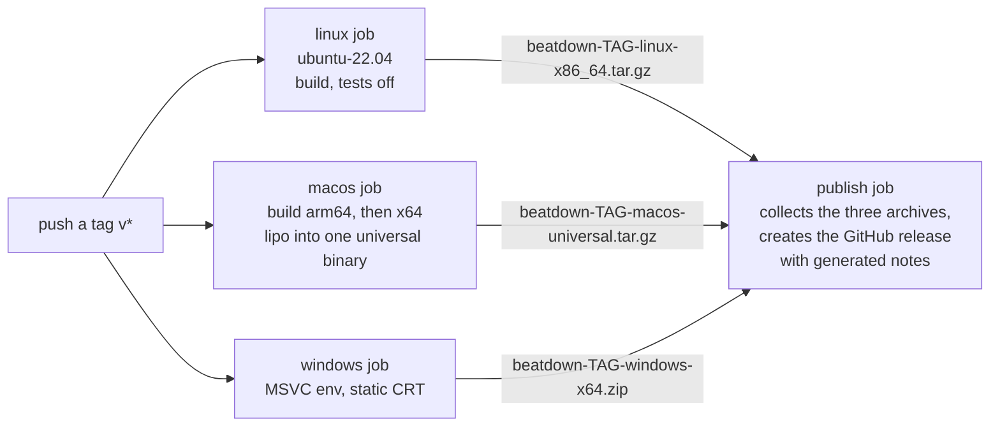

# `.github/workflows/`: CI and releases

Two GitHub Actions workflows. One builds and tests every push on all three operating systems. The other turns a version tag into downloadable release binaries.

Both build exactly the way a developer does locally (`cmake --preset …`, then `cmake --build --preset …`), through the vcpkg submodule in [`external/`](../../external/README.md). There is no separate CI-only build recipe.

## `ci.yml`: build and test on every push

**When:** on a push to any branch, and on pull requests. A branch with an open PR is therefore built twice per push, once for each event. The project's rulings log lists this as a known, deferred inefficiency.

**What:** one job, run as a matrix on `ubuntu-22.04`, `macos-latest` (Apple Silicon) and `windows-latest`. Each leg:

1. Checks out the repository *with submodules*, because vcpkg is a submodule.
2. Restores the vcpkg binary cache (explained below).
3. Installs the OS's build tools:
   - Linux: `apt`, including `nasm`, which FFmpeg's x86-64 assembly needs.
   - macOS: `brew`. No `nasm`, since the target is arm64.
   - Windows: the MSVC environment, via [`../actions/msvc-env`](../actions/msvc-env/README.md).
4. Bootstraps vcpkg, configures (`cmake --preset default`) and builds.
5. Runs the whole test suite (`ctest --preset default`, which prints output only for failing tests).
6. Uploads the built executable as an artifact named `beatdown-<os>`, handy for trying a branch's binary without building it.

**The slow part is "Configure".** That's when vcpkg compiles every dependency from source: libsndfile and its codecs, LAME, FFmpeg, CLI11 and Catch2. With a warm cache it takes seconds to a couple of minutes. When the dependency set changes it rebuilds, and FFmpeg alone takes roughly 5 minutes on Linux and macOS, and about 13 on Windows.

**The cache:**
- vcpkg writes each finished package as a zip into `.vcpkg-cache/`, the directory named by `VCPKG_DEFAULT_BINARY_CACHE`. `actions/cache` saves and restores that directory.
- The cache key is the OS plus a hash of `vcpkg.json`. `vcpkg.json` also pins the vcpkg baseline, so any change of dependencies or versions produces a new key.
- If the exact key misses, the `restore-keys` prefix restores the newest older cache anyway. vcpkg then reuses every package whose inputs didn't change and rebuilds only the rest.

## `release.yml`: from a tag to a GitHub release

**When:** on pushing a tag that starts with `v`, for example `v0.2.0`.

- **Linux:** builds with the `default` preset, with tests switched off (`-DBEATDOWN_BUILD_TESTS=OFF`), and packs the executable into a `.tar.gz`.
- **macOS:** builds twice, with the `macos-arm64` and then the `macos-x64` preset. Each uses its own vcpkg triplet from [`triplets/`](../../triplets/README.md) and targets macOS 11 or later. `lipo` then merges the two into one *universal* executable. The x64 half cross-compiles FFmpeg's x86-64 assembly, which is why this job installs `nasm` and the CI macOS leg doesn't.
- **Windows:** same as Linux, zipped. The vcpkg triplet is `x64-windows-static`, selected in the top-level `CMakeLists.txt`. It links all libraries and the C runtime statically, so the `.exe` runs on a machine with nothing installed.
- **Publish:** waits for all three, downloads their archives, and creates the GitHub release with automatically generated notes. It's the only job that needs write permission to the repository.

**Worth knowing:**
- The release workflow does *not* run the tests. It relies on CI having passed for the same commit, another item on the deferred list.
- The Linux and Windows jobs use the same cache key as CI (`vcpkg-<OS>-default-<hash>`), so a release can reuse packages that CI already built. macOS gets a separate `macos-universal` key because it builds two triplets.

## No `.github/README.md`

This page is `.github/workflows/README.md`, not `.github/README.md`, on purpose. GitHub shows a `.github/README.md` *instead of* the repository's real README on its front page. The overview of `.github/` as a whole lives in the root [`ARCHITECTURE.md`](../../ARCHITECTURE.md).
