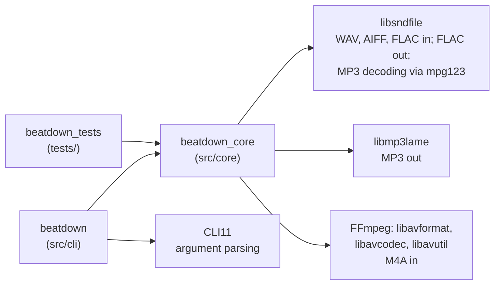

# `src/`: the program

All of beatdown's source code, in two parts:

- [`core/`](core/README.md): the conversion engine, built as the static library `beatdown_core`.
  - It plans a batch and converts files in parallel.
  - Each output is written under a temporary name and checked (headers, then the audio itself) before being renamed into place.
  - It reports the results.
  - Almost all of the logic, and almost all of the tests, are here.
- [`cli/`](cli/README.md): the `beatdown` executable, just `main()`. It parses the command line into `Options`, runs the engine, and turns the result into an exit code.

## How the two fit together

- **One direction only.** `cli` depends on `core`; `core` knows nothing about the command line. This is deliberate: the PRD plans a GUI later, which would sit next to `cli` and reuse `core` unchanged. The test suite also calls `core` directly, bypassing the CLI except where it tests the CLI itself.
- **Includes are rooted at `src/`.** CMake adds `src/` to the include path, so code includes `"core/decoder.hpp"` or `"core/platform/platform.hpp"`, never relative paths.
- **Third-party libraries come from vcpkg** (see [`../external/`](../external/README.md)) and are linked statically, so the finished `beatdown` executable needs nothing installed. FFmpeg is private to `core`'s implementation: no `core` header includes an FFmpeg header. The only other code that uses it is the test fixtures, which use FFmpeg's *encoders* to create M4A test files.
- **One namespace.** Everything in `core` is in `namespace beatdown` (the OS shim in `beatdown::platform`). `cli/main.cpp` is plain global-scope code that calls into it.
- **Where the build is defined:** the top-level `CMakeLists.txt`. It defines three targets: `beatdown_core`, `beatdown` and `beatdown_tests`. It picks the POSIX or Windows file for the platform shim, and it passes the version number in as `BEATDOWN_VERSION`.

Up: [repository overview](../ARCHITECTURE.md)
