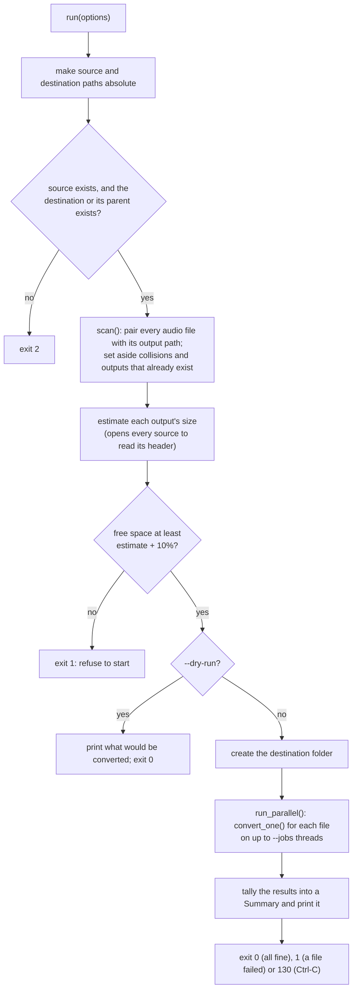
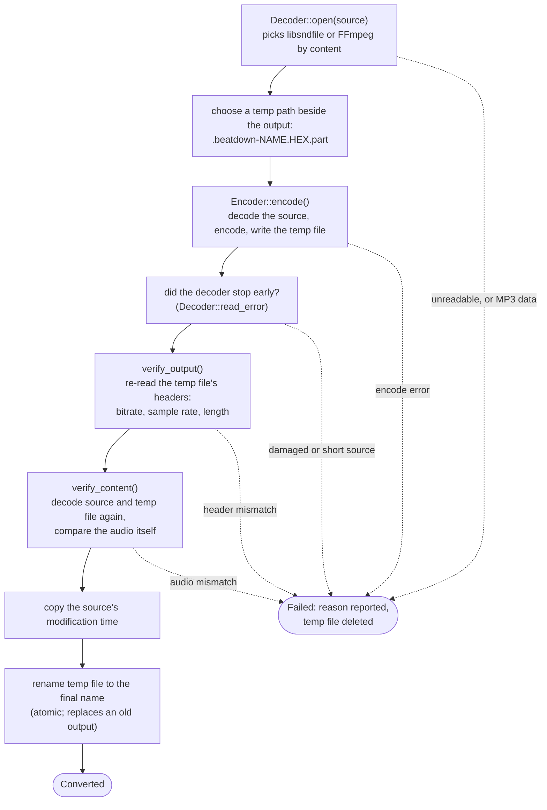
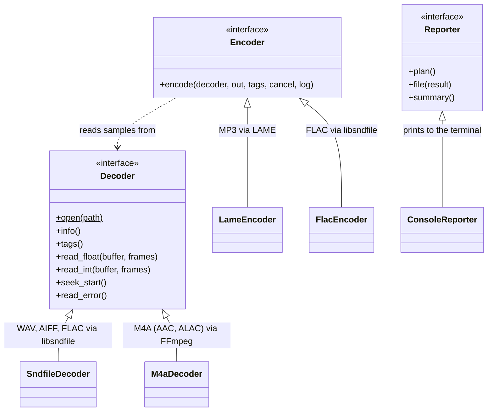

# `src/core/`: the conversion engine

Everything beatdown actually *does* lives here, compiled into one static library, `beatdown_core`. The command-line program in [`../cli/`](../cli/README.md) is a thin wrapper around it, and the test suite in [`../../tests/`](../../tests/README.md) links it directly. Keeping the engine separate from the CLI is deliberate: the PRD plans a GUI later, and it's meant to reuse this library unchanged.

The engine does three things:
- **Plan** a batch: which files to convert, and which to skip and why.
- **Convert** each file, in parallel, using the decoder and encoder libraries.
- **Report** what happened.

Outputs are never written in place. Each is written under a temporary name, checked, and only then renamed into place.

## A batch, start to finish: `run()`

Nothing is created on disk until the free-space check has passed, not even the destination folder. A dry run follows exactly the same path, including refusing for lack of space, and stops just before creating anything.

## One file, start to finish: `convert_one()`

The temp file sits in the same folder as its output, so the final rename never crosses a drive boundary. A small guard object deletes it on *any* early exit: failure, cancellation, or an exception.

## The three extension points

The engine is built around three small interfaces, so a format or a way of reporting can be added without touching the pipeline:

## The files, grouped by job

Each `x.cpp` here is tested by `tests/test_x.cpp`.

### Running a batch

- **`runner.{hpp,cpp}`**: `run()`, the whole batch as drawn above.
  - It works on a copy of the options with absolute paths. A bare relative destination like `Release` would otherwise look as if its parent folder were missing.
  - It enforces the "destination rule". Only the destination's *last* folder may be created. If its parent doesn't exist (an unmounted drive, a typo), it stops with exit code 2 rather than creating a phantom path on the boot disk.
  - Each file converts inside a `try`, so one file's unexpected exception becomes an ordinary failure instead of ending the batch.
  - A disk-full failure raises the same cancel flag Ctrl-C does, so no new files start. The summary then says "disk full" rather than "interrupted".
  - The conversion function is a parameter, which lets tests substitute a fake one.
- **`scheduler.{hpp,cpp}`**: `run_parallel()`, a minimal thread pool.
  - Workers repeatedly claim the next job index from an atomic counter.
  - They stop claiming once the cancel flag is set or a job has thrown.
  - The first exception is rethrown on the caller after every started job has finished. It returns how many jobs were started.
- **`converter.{hpp,cpp}`**: `convert_one()`, one file as drawn above, plus three helpers:
  - `temp_path_for()`: a unique hidden `.part` name beside the output.
  - `resolve_tags()`: the source's own tags win. With `--tag-from-name`, missing fields are filled from an "Artist - Title" filename.
  - `looks_like_disk_full()`.

  It refuses sources that are already MP3, since re-encoding lossy audio only loses more. It copies the source's modification time onto the output before the rename.

### Deciding what to do

- **`options.hpp`**: `Options`, every setting from the command line, plus `Format` (MP3 or FLAC) and `EncodeSettings` (CBR bitrate or VBR level).
  - `effective_jobs()` defaults `--jobs` to the number of hardware threads.
  - `output_extension()` gives `.mp3` or `.flac`.
  - One field, `space_override_available`, exists only so tests can pretend the disk has a given amount of free space.
- **`scanner.{hpp,cpp}`**: `scan()` turns the source folder (or single file) into a `Plan`: a list of `Job`s to convert and a list skipped with a reason.
  - **Which files count:** audio is recognised by extension (`.wav .wave .aif .aiff .aifc .flac .m4a`, any case). macOS `._` resource-fork files and everything else are counted as "ignored".
  - **Where outputs go:** each output keeps its file's relative sub-folder, name and new extension.
  - **Walking:** folders are walked recursively unless `--no-recursive`. A destination that sits *inside* the source isn't walked into.
  - **Skip rules:** jobs are sorted by path, then checked in this order:
    1. The output would be the source itself.
    2. The output would land on another source file. This is checked both by path (ignoring ASCII case, as macOS and Windows do) and by *file identity*, which catches Unicode-normalization twins and symlinked destinations.
    3. Two sources map to one output (`Track.wav` and `Track.aiff`): the first in sorted order wins.
    4. The output already exists and `--overwrite` isn't set.

    When it can't tell whether an output is a source file, it skips rather than risk overwriting.
- **`space.{hpp,cpp}`**: the free-space check.
  - An MP3 estimate is duration × bitrate; VBR assumes 256 kbps.
  - A FLAC estimate is 70% of the uncompressed audio size.
  - The run needs the estimate plus a 10% margin.

### Reading sources

- **`decoder.{hpp,cpp}`**: the `Decoder` interface, `AudioInfo`, and the libsndfile implementation.
  - **`AudioInfo`** holds channels, sample rate, frame count, bit depth and whether the samples are float.
  - **Reading:** a decoder hands out interleaved samples, either as floats (nominally −1…+1) or as 32-bit integers, left-aligned so that a 16-bit sample *x* reads back as *x* × 65536. That is libsndfile's convention, and the M4A decoder copies it so the encoders don't care which one they got.
  - **Choosing a backend:** `Decoder::open()` picks by the file's *content*: files starting with an MP4 `ftyp` box go to FFmpeg, everything else to libsndfile.
  - **`SndfileDecoder`:**
    - Reads WAV, AIFF and FLAC.
    - Also recognises MP3, so the converter can refuse it.
    - Tags come from the file's metadata. For WAV, an embedded ID3 chunk wins because it can hold Unicode.
  - **`sf_open_mutex()`:** every libsndfile open, reading or writing, must hold this one process-wide lock.
    - mpg123, libsndfile's MP3 backend, has a race inside its setup on ARM.
    - libsndfile keeps its last error in a global.
- **`m4a_decoder.{hpp,cpp}`**: the FFmpeg backend for M4A.
  - **How it reads:** FFmpeg's MP4 demuxer finds the audio track, and FFmpeg's *own* AAC or ALAC decoder decodes it. It asks for them by name, so macOS never swaps in Apple's decoder and every OS produces identical samples.
  - **File access:**
    - FFmpeg reads the file through beatdown's own file handle.
    - It is forbidden to open anything else.
    - Its log output is silenced; errors come back as messages instead.
  - **Opening:** it decodes the first frame straight away to learn the *real* sample rate and channel count. HE-AAC and parametric-stereo files decode differently from what their header says.
  - **Gapless:** encoder priming at the start is trimmed. Output stops at the length the file declares, so the encoder's end padding is dropped too.
  - **Damage detection:**
    - It checks that every packet decodes to the length the file gives it.
    - It rejects packets cut short by the end of the file.
    - It reports a stream that ends noticeably short of its declared length.

    Any of these is reported through `Decoder::read_error()`, which `convert_one()` checks after encoding.
  - **`info().frames`** is the declared length until the stream has been read to its end, then the exact decoded count.
  - Open design questions about this backend are tracked in issues #3–#8.
- **`id3v2.{hpp,cpp}`**: reads ID3v2.3/2.4 tags (the tag format inside MP3s, and optionally inside WAVs as an `id3 ` chunk).
  - It reads title, artist, album, year, track, genre and comment.
  - It understands all four text encodings (Latin-1, UTF-16 with and without BOM, UTF-8).
  - It also contains a test-only builder that writes small tags for the tests.
- **`tags.{hpp,cpp}`**: the `Tags` struct (seven optional text fields) and three small pure functions:
  - Split an "Artist - Title" filename on its first ` - `.
  - Strip configured suffixes (like `" Mastered_Master"`) from a title.
  - Merge two tag sets, where the first wins.

### Writing outputs

- **`encoder.{hpp,cpp}`**: the `Encoder` interface and `make_encoder()`, which picks LAME for MP3 and libsndfile for FLAC.
  - An encoder reads everything from a `Decoder` and writes one file.
  - It returns `""` on success, `"cancelled"`, or an error message.
  - It never renames anything; the converter owns the temp file.
- **`mp3_encoder.{hpp,cpp}`**: `LameEncoder`, which drives libmp3lame directly with the same settings as `lame --cbr -b 320 -q 0`.
  - **Sample rate:** 44.1 and 48 kHz stay as they are. Lower rates go up to 44.1 kHz and higher ones down to 48 kHz. This keeps every file MPEG-1, the only MP3 version that allows 320 kbps.
  - **Channels:** it refuses more than two.
  - **Tags:** it writes ID3v2 tags as UTF-16, or no tag block at all when there are none.
  - **Gapless and seeking:** at the end it writes LAME's Info frame back at the start of the file. Players use it for gapless playback and fast seeking.
  - **No silent substitutions:** LAME quietly substitutes a bitrate or sample rate it can't do. The encoder checks for that *before* writing anything and refuses, rather than failing verification after a full encode.
- **`flac_encoder.{hpp,cpp}`**: `FlacEncoder`, using libsndfile's FLAC writer at compression level 8.
  - 16- and 24-bit sources are copied bit-exactly as integers.
  - 32-bit integer and float sources become 24-bit, libsndfile's maximum. Float samples beyond ±1.0 are clipped.
  - Tags become Vorbis comments.

### Checking outputs

A file is only renamed into place after passing two checks: its headers, then its audio.

- **`verifier.{hpp,cpp}`**: the *header* check.
  - **MP3:**
    - It parses the file.
    - It needs at least one real audio frame, and at most 128 stray bytes after the last one.
    - The sample rate must match the rule above.
    - A CBR file must use one constant bitrate; a VBR file must have a Xing header.
    - The duration must be within 1 second of the source.
  - **FLAC:** reopens the file and compares channels, sample rate and exact frame count with the source.
- **`mp3_parse.{hpp,cpp}`**: a small MP3 frame walker used by the verifier.
  - It skips a leading ID3 tag and recognises LAME's Info/Xing frame.
  - It counts audio frames, collects the bitrates seen and measures trailing bytes.
  - It has a test-only frame builder.
- **`content_check.{hpp,cpp}`**: the *audio* check, `verify_content()`. It re-opens the source and the new file and compares what they actually sound like.
  - **FLAC:** compared sample by sample.
    - 16- and 24-bit sources must match exactly.
    - 32-bit integer sources are allowed the 24-bit rounding.
    - Float sources are allowed about two 24-bit steps.
  - **MP3:**
    - Both sides pass through the same low-pass filter, at 16 kHz or lower for low sample rates, so the MP3's intentional cut above ~20 kHz isn't counted as a difference.
    - The decoded length must match exactly, or within ±2 samples if the rate changed.
    - Each channel's overall level must be within ±0.5 dB.
    - Every one-second block louder than −50 dBFS must be within ±1 dB, except the first and last.
    - It also reports the MP3's decoded peak, which feeds the "very loud masters" line in the summary.

  The tolerances come from measurements recorded in `docs/club-readiness-measurements.md`. They are why the CLI only offers the MP3 settings this check can certify.

### Telling the user

- **`report.{hpp,cpp}`**: the `Reporter` interface, the `Summary` of a run (counts, sizes, time, failures, exit code) and `ConsoleReporter`.
  - **Per file**, it prints one line: ✓ converted, ✗ failed with the reason, = skipped, → would convert in a dry run.
  - **At the end**, it prints the summary, which always includes a recap of every failure, even under `--quiet`.
  - `--quiet` keeps only the failures and the summary; `--verbose` adds encoder settings, skip lines and decoded peaks.
  - Worker threads call `file()` concurrently, so every write takes one output lock.

### Shared helpers

- **`unicode.{hpp,cpp}`**:
  - **Conversions** between UTF-8, UTF-16 and Latin-1.
  - **`path_to_utf8` / `path_from_utf8`** convert between paths and UTF-8 text without going through Windows' ANSI code page.
  - **`sanitize_utf8()`** returns valid UTF-8 unchanged, except that the two "noncharacters" U+FFFE and U+FFFF become U+FFFD. Anything that *isn't* valid UTF-8 is assumed to be Windows-1252 (what old Windows tools wrote into WAV tags) and re-decoded from that. Every tag passes through it before reaching an encoder.
- **`std_names.hpp`**: `using std::string;` and friends, declared *inside* `namespace beatdown` so project code can write `string` instead of `std::string` without leaking that into anyone else's code. A few names (`std::move`, `std::min`/`max`, …) are deliberately left qualified; the header explains why.
- **`version.{hpp,cpp}`**: `version()` returns the version string that CMake passes in from `project(beatdown VERSION …)`.

## Subdirectories

- [`platform/`](platform/README.md): the four operating-system-specific functions: Ctrl-C handling, UTF-8 console, opening a file by path with libsndfile, and file identity.

## Rules to keep when changing code here

- **Sources are only ever read.** Outputs appear only by renaming a temp file that passed both checks. Never write to an output's final name directly.
- **Hold `sf_open_mutex()` around every libsndfile open**, for reading or writing.
- **Send every tag string through `sanitize_utf8()`** before it reaches an encoder. libFLAC rejects invalid UTF-8, and libsndfile mishandles that rejection badly enough to crash the whole batch.
- **The scanner's collision rules protect the user's source files.** When a check can't decide, it skips. Keep it that way.
- **After `Encoder::encode()`, check `Decoder::read_error()`.** For an M4A, the verification checks can't see audio that's missing from the source itself.
- **Decode MP3s for checking through `Decoder` (libsndfile + mpg123)**, never LAME's own decoder. LAME's decoder shares a buffer between threads and corrupts results under `--jobs`.
- **Changing MP3 encoder settings means re-checking the content-check tolerances.** They're backed by measurements.
- **`Reporter` methods may be called from several threads at once.**
- **Comments cite where rules came from** ("R25", "Task 18", "Ruling R-F", "Finding 3"). [`docs/superpowers/plans/README.md`](../../docs/superpowers/plans/README.md) explains the labels.

Up: [`src/`](../README.md)
